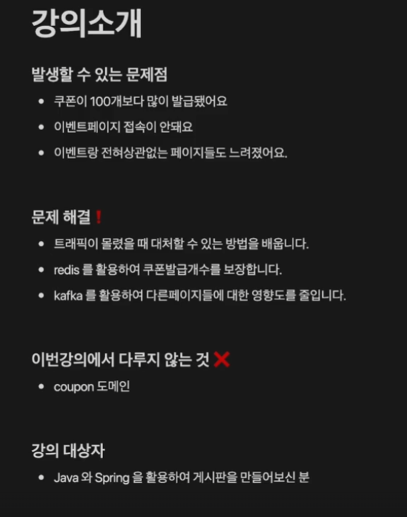
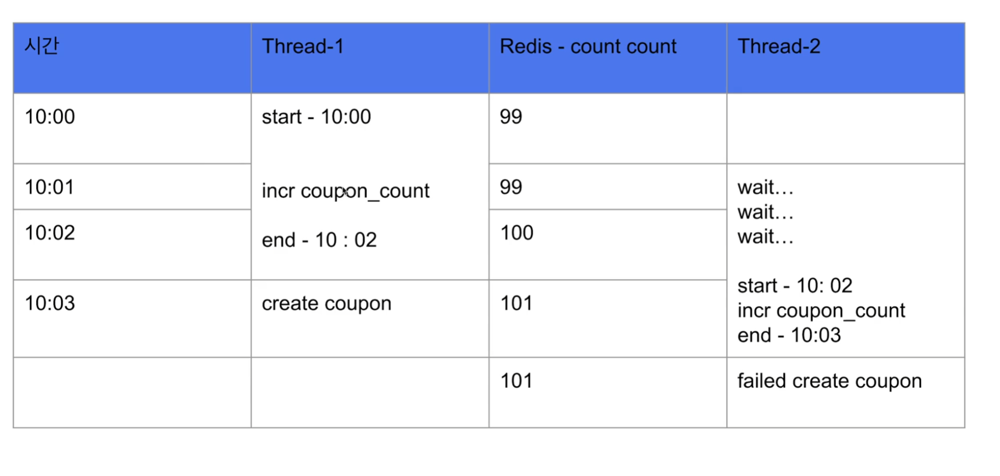
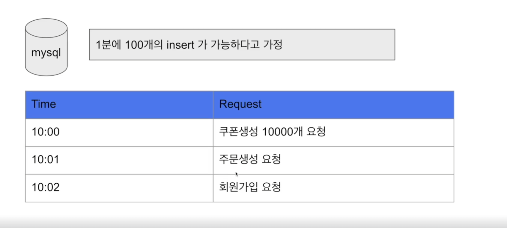
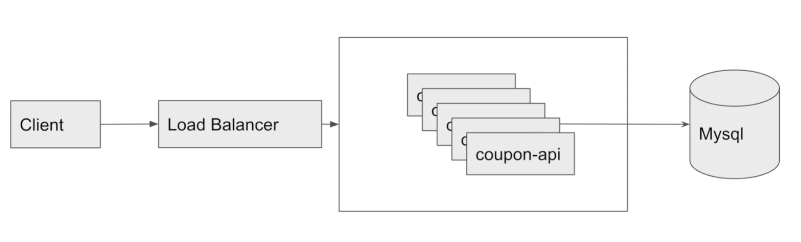
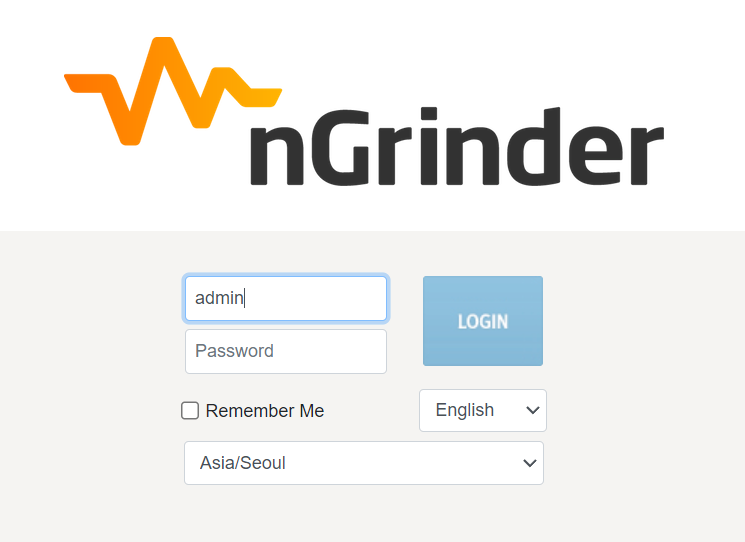
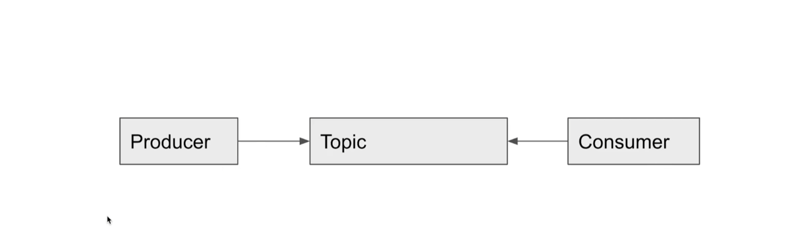
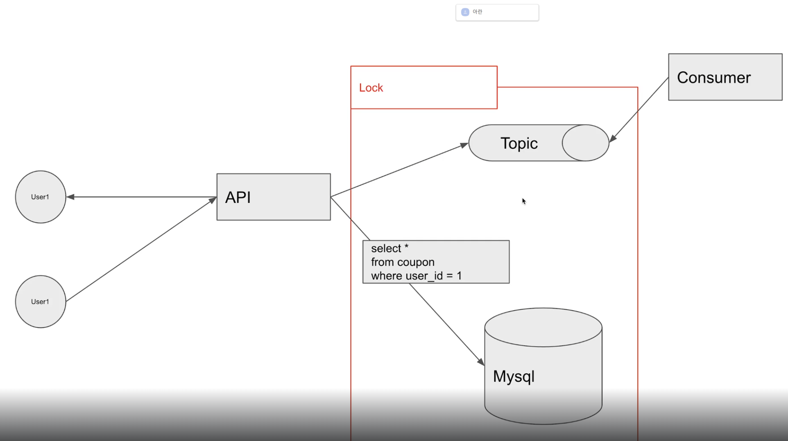
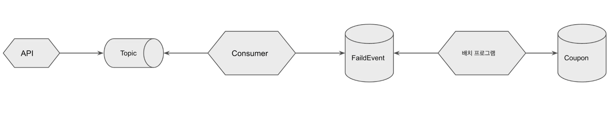

"재고" 는 "상품" 의 데이터기 때문에 컬럼으로 관리

"쿠폰" 같은경우는 어디에 종속되는 데이터가 아니라 "쿠폰" 데이터 그 자체이기 때문에 새로운 엔티티를 생성



synchronezed 키워드를 사용하면 동시성 문제가 해결되지만 서버가 여러대가 되면 데이터의 접근을 여러대가 할 수 있기 때문에 동시성 문제가 발생하기 떄문에 잘 사용하지 않는 방법이다.

Mysql과 Redis로 락을 걸어 해결할 수 있음
하지만, 쿠폰 개수에 대한 정합성을 얻기 위해 락을 구현한다면 발급된 쿠폰 개수를 가져오는 것부터 쿠폰을 생성할까지 락을 걸어야하기 때문에 성능 이슈가 발생할 수 있음

만약 락이 2초가 걸린다면 2초가 걸린 후 쿠폰을 발급해 줄 수 있음
그러면 쿠폰을 발급하는데 대기시간이 오래걸림

redis에는 incr 명령어가 존재해 이것을 사용해서 해결할 것

redis는 싱글쓰레드로 기반으로 동작하기 때문에 레이스 컨디션을 해결할 수 있음


```java
    public Long increment() {
        return redisTemplate.opsForValue().increment("coupon_count", 1);
    }
    
```

```java

@Service
@RequiredArgsConstructor
@Slf4j
public class ApplyService {
    private final CouponRepository couponRepository;
    private final CouponCountRepository couponCountRepository;

    public void apply(Long userId) {
        Long count = couponCountRepository.increment();
        log.info("count: {}", count);
        if (count > 1000) {
            return;
        }
        couponRepository.save(Coupon.builder()
                .userId(userId)
                .build());
    }
}

```

### 이 코드의 문제점
이 방식은 발급하는 쿠폰의 개수가 많아질수록 RDB에 부하를 주게 된다.





아이디/패스워드: admin/admin



### 카프카 설치


카프카의 기본 구조



### 카프카 테스트용
토픽 생성
docker exec -it kafka kafka-topics.sh --bootstrap-server localhost:9092 --create --topic testTopic

프로듀서 실행
docker exec -it kafka kafka-console-producer.sh --topic testTopic --broker-list 0.0.0.0:9092

컨슈머 실행
docker exec -it kafka kafka-console-consumer.sh --topic testTopic --bootstrap-server localhost:9092


### 카프카 토픽 생성

docker exec -it kafka kafka-topics.sh --bootstrap-server localhost:9092 --create --topic coupon-create

### 카프카 컨슈머 실행
docker exec -it kafka kafka-console-consumer.sh --topic coupon_create --bootstrap-server localhost:9092 --key-deserializer "org.apache.kafka.common.serialization.StringDeserializer" --value-deserializer "org.apache.kafka.common.serialization.LongDeserializer"


### 1인 1개 쿠폰 발급하기
userId와 couponType을 유니크로 잡아서 하는방식이 있다.
실용적이지는 않음

```java


package org.example.consumer.domain;

import jakarta.persistence.Entity;
import jakarta.persistence.GeneratedValue;
import jakarta.persistence.GenerationType;
import jakarta.persistence.Id;
import lombok.AccessLevel;
import lombok.Builder;
import lombok.Getter;
import lombok.NoArgsConstructor;

@Entity
@NoArgsConstructor(access = AccessLevel.PROTECTED)
@Getter
public class Coupon {
    @Id
    @GeneratedValue(strategy = GenerationType.IDENTITY)
    private Long id;

    private Long userId;
    
    @Builder
    public Coupon(Long id, Long userId) {
        this.id = id;
        this.userId = userId;
    }
}


```




### 쿠폰 발급하다가 에러가 발생할때 처리


